<div align="center">


# NebuShell

<p>
  <strong>Creator / Owner: jiayizhen</strong><br />
  <strong>Companies: MrToken &amp; Nebulaedata</strong>
</p>

<p>
  
  
  
</p>

**An AI‑agent‑powered SSH client / 由 AI 智能体驱动的运维终端**

_A modern SSH client with a built‑in AI ops agent that can run, diagnose, and operate your servers — with your confirmation._

<sub>Powered by MrToken &amp; Nebulaedata · Created by jiayizhen</sub>

[](LICENSE)
[](https://github.com/SoySauceJYZ/NebuShell/stargazers)
[](https://github.com/SoySauceJYZ/NebuShell/releases)
[](https://www.electronjs.org/)
[](https://react.dev/)
[](https://www.typescriptlang.org/)
[](https://electron-vite.org/)

[English](#english) · [中文](#中文) · [Download](https://github.com/SoySauceJYZ/NebuShell/releases) · [GitHub](https://github.com/SoySauceJYZ/NebuShell)

</div>

---

<a id="english"></a>

## English

### Overview

**NebuShell** is a cross‑platform desktop SSH client with a first‑class AI ops agent baked in. Connect to your servers, open multiple terminals, browse and edit remote files over SFTP, and let the built‑in agent run commands, read their output, and carry out operations for you — always behind an explicit plan‑and‑confirm workflow, so nothing runs on your machines without your say‑so.

Everything is stored locally and secured by a master‑password vault. No cloud account required.

### Features

- 🖥️ **Multi‑tab terminals & flexible split view** — xterm.js terminals with a fit addon, web links, and per‑theme styling. Split any pane **right or down** from the tab‑strip buttons, keep splitting the split‑out panes **recursively** into any grid, **drag tabs** between panes (drop on an edge to make a new split, on the center to merge), and drag the dividers to resize.
- 🤖 **Built‑in AI ops agent** — an OpenAI‑compatible agent that can `run_command`, `read_command_output`, `ask_user`, and `present_plan`. It proposes a plan, asks for confirmation, then executes across one or many terminals.
- 🔐 **Encrypted vault** — hosts, passwords, and SSH keys are protected behind a master password; the keychain never leaves your machine.
- 📁 **SFTP file browser** — dual‑pane remote/local file management with drag‑and‑drop transfers and a live transfer queue.
- 📝 **Built‑in editor** — a Monaco (VS Code) editor for quickly editing remote and local files, with syntax highlighting.
- 🖼️ **Image preview** — open remote images directly in a tab.
- 🗂️ **Host management** — organize connections, duplicate sessions, reconnect, and jump between them from the tab bar.
- ⌨️ **Command history & command palette** — every command you type is saved locally per server (tagged **User** / **Agent**) and shared across that host's tabs; a history panel splits **Local** vs the server's own `~/.bash_history`. Triple‑tap **Ctrl** to open a tabbed palette that searches history and runs quick actions — picking a command drops it into the prompt **without executing**.
- 📜 **History docs** — keep track of past sessions and documents.
- 📊 **System monitor** — per‑core CPU with a live sparkline, a memory donut, network up/down rates, per‑mount disk usage with read/write I/O, and a process manager you can search and kill from.
- 🎨 **Light / dark themes** — a clean, modern UI that adapts to your OS.

### What's New

**Recent updates (July 2026)**

- 🪟 **Draggable, recursive split view** — split panes now keep splitting. Each pane's tab strip (and the top bar) gains **向右分屏 / 向下分屏** buttons that split a pane **right or down** — including the panes you already split, so you can build any grid. **Drag a tab** by mouse from one pane into another: drop on an **edge** to carve out a new split, or on the **center** to merge it into that pane. Splitting a single‑tab terminal pane duplicates the session into the new pane, and the dividers have a wider grab zone for easier resizing. (Dragging is pointer‑based rather than HTML5 drag‑and‑drop, so it works reliably inside the app window.)
- 📜 **Persistent command history** — commands you type are now saved **locally per server** (surviving restarts) and shared across every tab of that host, each tagged **User** or **Agent** — agent‑run commands are captured too, not just what you type. The history panel gains a **Local / Server** split, where the Server tab reads the box's own `~/.bash_history` / `~/.zsh_history`. Click any command to drop it into the input line **without running it**, delete single entries, or clear a server's history.
- ⌨️ **Triple‑Ctrl command palette** — tap **Ctrl three times** in a terminal to pop a tabbed palette: **历史记录 (History)** searches your merged local + server history, **快捷操作 (Quick actions)** fires common actions. **Tab / Shift+Tab** switch tabs, **↑/↓ + Enter** pick, and the chosen command is inserted into the prompt (never auto‑run).
- 🛡️ **Agent terminal anti-jam** — the agent no longer hangs on blocking commands (`tail -f`, `top`, interactive `[Y/n]` prompts). It actively **probes whether the shell is at a prompt**, and when a command jams the terminal it runs a recovery ladder (Ctrl‑C → Ctrl‑C → pager `q` → editor `:q!` → Ctrl‑Z suspend + `kill %1`), reporting a clear **interrupted / stuck** state instead of silently timing out. Completion is judged by an idle+ceiling heartbeat, so long jobs (`apt`, `docker build`) run to the end while truly stuck ones are recovered — and the agent is guided to bound streaming commands (`tail -n`, `top -bn1`, `timeout N …`).
- 📊 **Rich system monitor** — the monitor panel now covers system info (IP / OS / timezone / uptime), **per‑core CPU** with a live sparkline, a **memory donut** (used / cache / free), **network** up/down rates & cumulative traffic, **disk** usage per mount with read/write I/O, and a **process manager** (hotspot list plus a full searchable table with kill / force‑kill). All charts and colors adapt to the active theme.
- ⚡ **Faster SFTP transfers** — local↔remote uploads/downloads now use concurrent `fastPut` / `fastGet`, saturating high-latency links instead of sending one 32 KB chunk per round-trip. Large files move dramatically faster.
- 📈 **Transfer speed & ETA** — the transfer UI shows live throughput (MB/s) and estimated time remaining, not just a percentage.
- 🗂️ **Per-window transfer records** — transfers are grouped by the window that started them into a collapsible dock; finished transfers stay as browsable history until you clear them.
- ⚠️ **Close-tab protection** — closing a tab with an in-progress transfer now asks for confirmation, since closing tears down the SFTP connection.
- 📊 **Progress in the side-panel SFTP view** — the embedded SFTP panel shows transfer progress too, and the toolbar upload button supports multi-select with a progress bar.
- ⚙️ **Configurable transfer concurrency** — a new **Settings** page lets you tune the SFTP concurrency (default 64, range 1–256); the value is persisted.
- 🎨 **Terminal color fix** — the built-in themes now ship full 16-color ANSI palettes, fixing colored (especially white) text that was invisible on the light theme.

### Screenshots

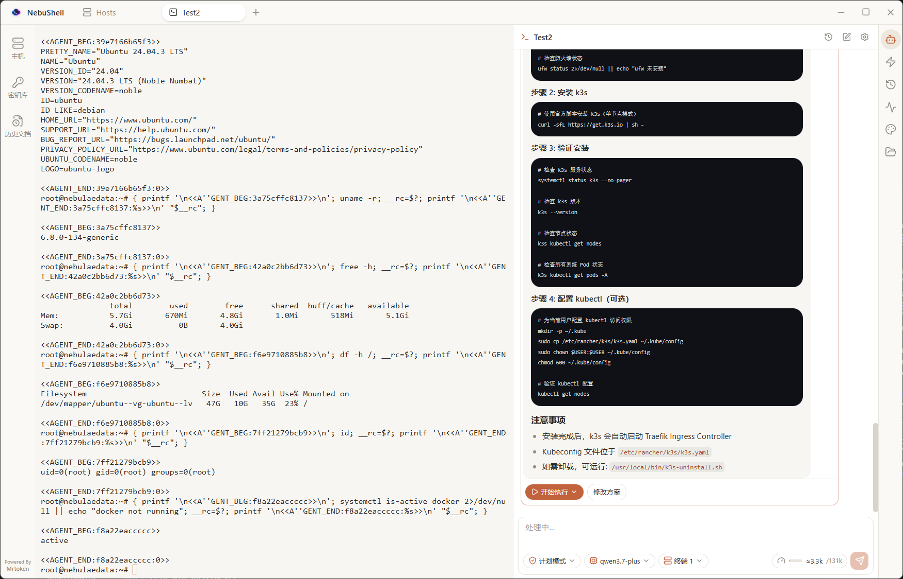

A ready-made landing page lives at [`docs/index.html`](docs/index.html) — open it in a browser or publish it via GitHub Pages.

| Vault setup                                                               | Add a host                                                               | Host management                                                                |
| ------------------------------------------------------------------------- | ------------------------------------------------------------------------ | ------------------------------------------------------------------------------ |
| 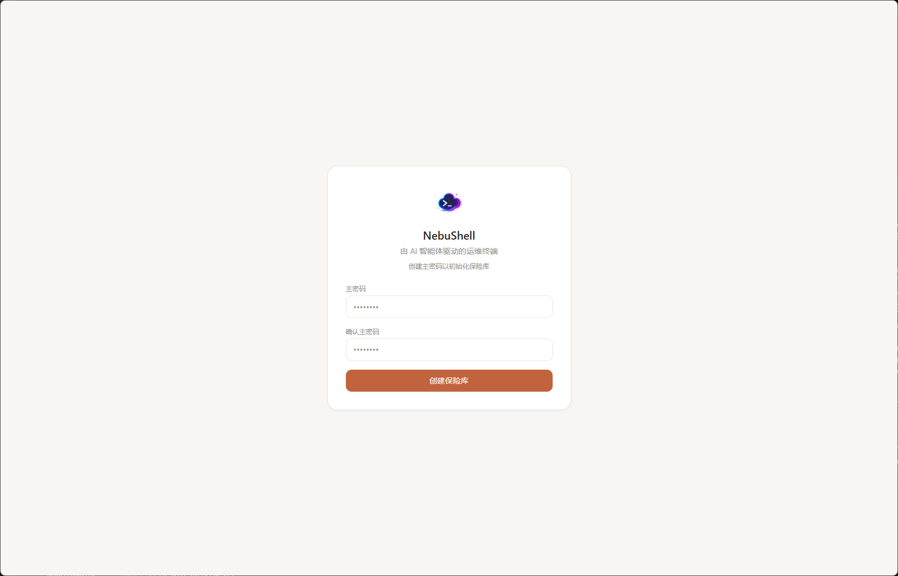 | 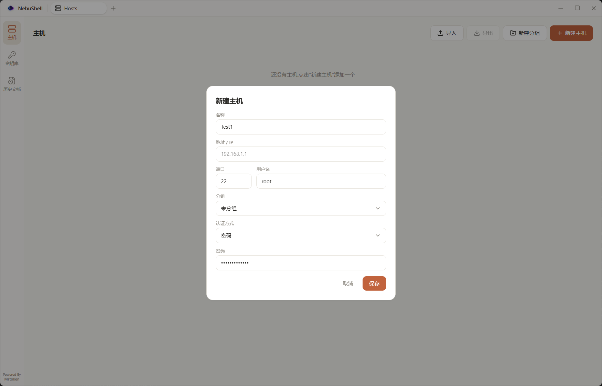 | 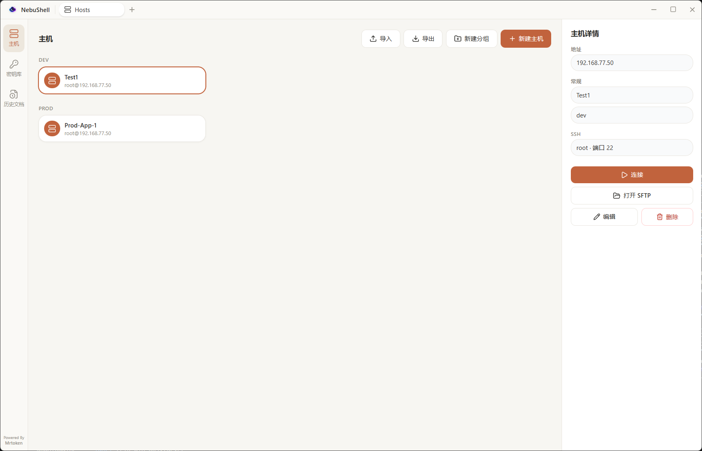 |

| SSH terminal                                                                    | Agent workspace                                                                          | Agent mode control                                                                             |
| ------------------------------------------------------------------------------- | ---------------------------------------------------------------------------------------- | ---------------------------------------------------------------------------------------------- |
| 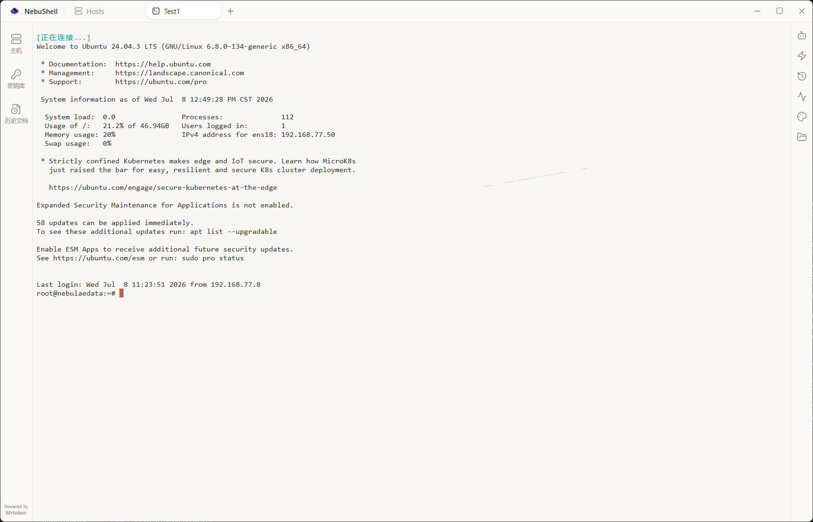 | 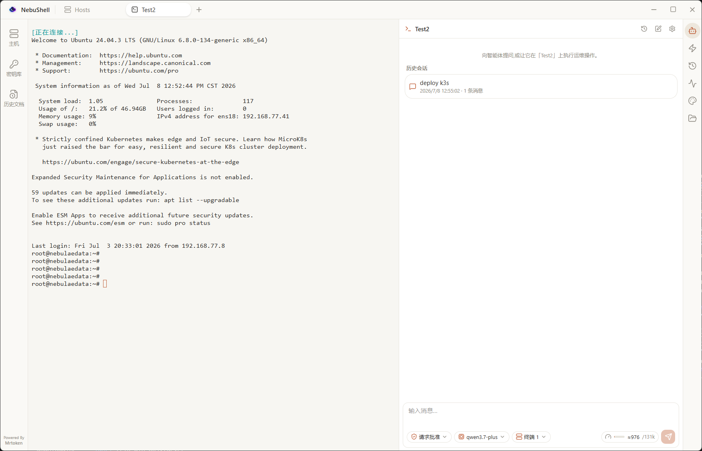 | 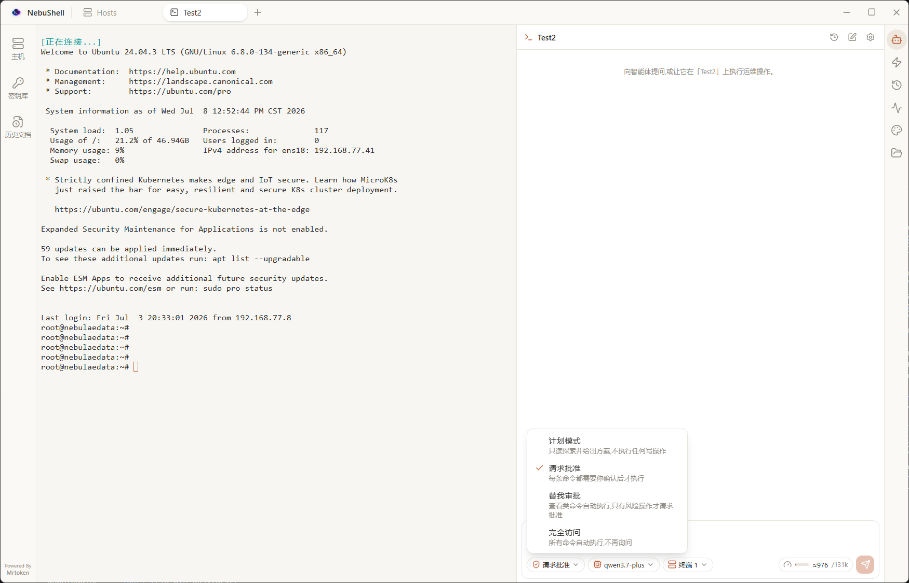 |

| Plan and confirm                                                                                | System checks                                                                           | Execution plan                                                                                     |
| ----------------------------------------------------------------------------------------------- | --------------------------------------------------------------------------------------- | -------------------------------------------------------------------------------------------------- |
| 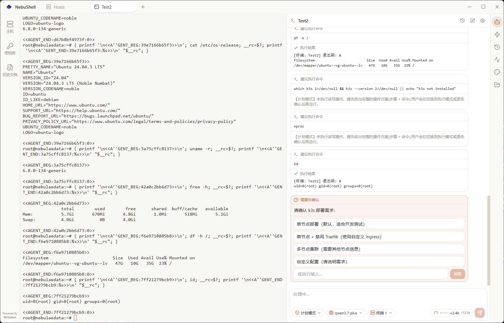 | 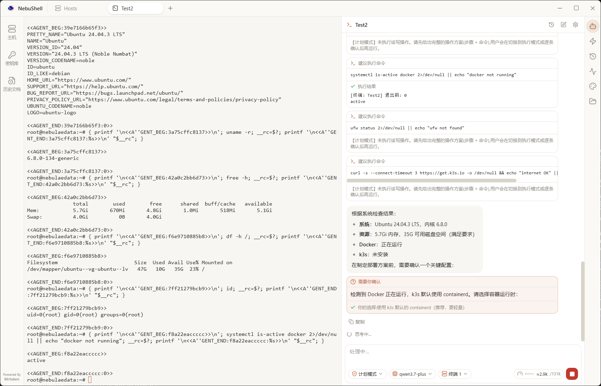 |  |

| Model provider                                                                      | SFTP browser                                                                               | Multi-pane SFTP                                                                            |
| ----------------------------------------------------------------------------------- | ------------------------------------------------------------------------------------------ | ------------------------------------------------------------------------------------------ |
| 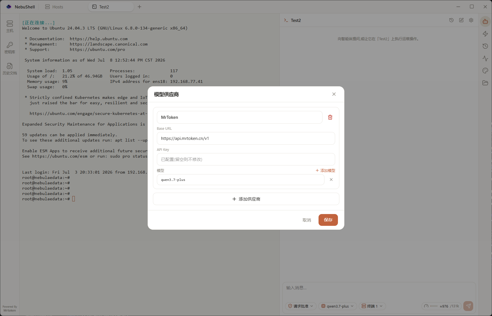 | 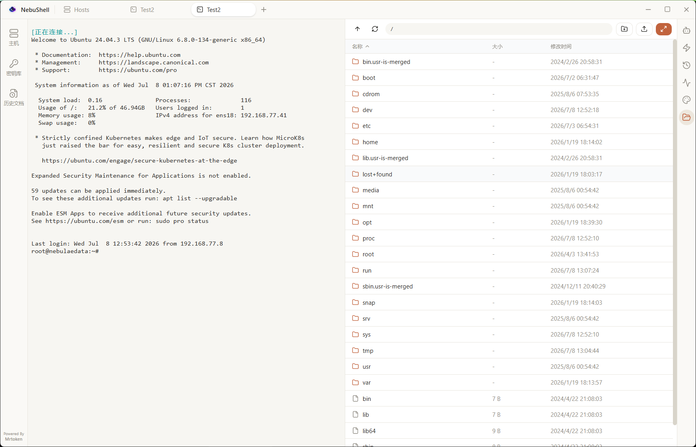 | 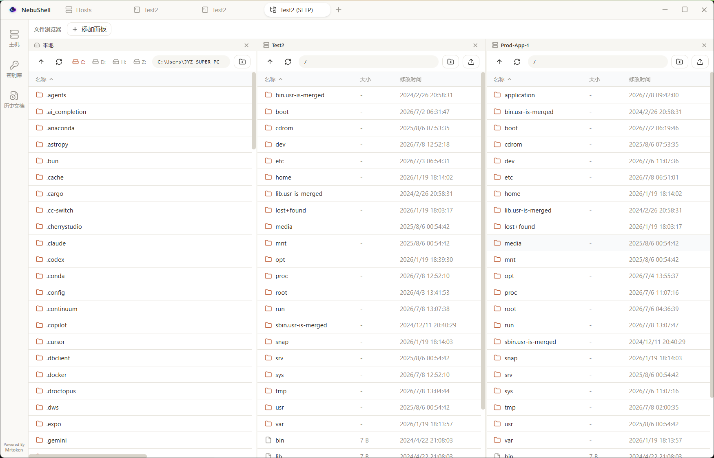 |

| Remote editor                                                                                     |
| ------------------------------------------------------------------------------------------------- |
| 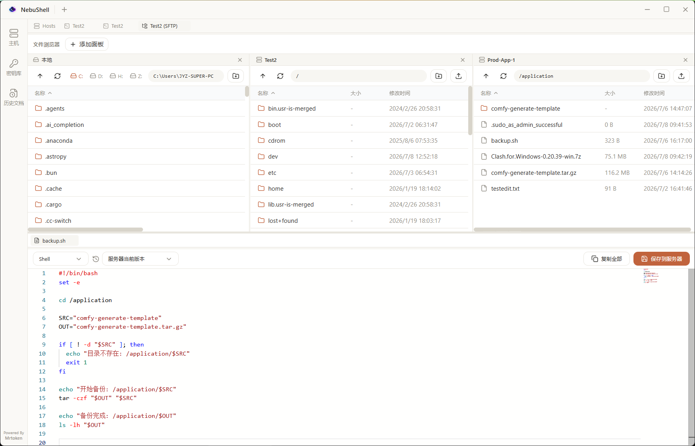 |

### Tech Stack

| Layer      | Tech                                                                                       |
| ---------- | ------------------------------------------------------------------------------------------ |
| Shell      | [Electron](https://www.electronjs.org/) + [electron-vite](https://electron-vite.org/)      |
| UI         | [React](https://react.dev/) + [TypeScript](https://www.typescriptlang.org/) + Tailwind CSS |
| Terminal   | [@xterm/xterm](https://xtermjs.org/)                                                       |
| Editor     | [Monaco Editor](https://microsoft.github.io/monaco-editor/)                                |
| SSH / SFTP | [ssh2](https://github.com/mscdex/ssh2)                                                     |
| State      | [Zustand](https://github.com/pmndrs/zustand)                                               |

### Getting Started

**Prerequisites:** [Node.js](https://nodejs.org/) 18+ and npm.

```bash
# Clone the repo
git clone https://github.com/SoySauceJYZ/NebuShell.git
cd NebuShell

# Install dependencies
npm install

# Start in development mode
npm run dev
```

> Prefer a prebuilt binary? Grab the latest from the
> [Releases page](https://github.com/SoySauceJYZ/NebuShell/releases).

### Build

```bash
# Windows  →  dist/NebuShell-<version>-setup.exe
npm run build:win

# macOS    →  dist/NebuShell-<version>.dmg   (must be built on macOS)
npm run build:mac

# Linux    →  dist/NebuShell-<version>.AppImage (+ snap / deb)
npm run build:linux

# Unpacked directory (quick smoke test, no installer)
npm run build:unpack
```

### Configuring the AI Agent

The agent talks to any **OpenAI‑compatible** endpoint. Open the agent settings in‑app and provide:

- **Base URL** — e.g. `https://api.openai.com/v1` or your own gateway
- **API Key**
- **Model** — e.g. `gpt-4o`, `claude-...` via a compatible proxy, or a local model

The agent will refuse to run until all three are set.

### Project Structure

```
src/
├── main/           # Electron main process
│   ├── ssh/        # SSH connection manager
│   ├── sftp/       # SFTP manager
│   ├── vault/      # Encrypted credential vault
│   ├── llm/        # LLM client (OpenAI-compatible)
│   └── ipc/        # IPC handlers
├── preload/        # Preload bridge
└── renderer/       # React UI (terminals, SFTP, editor, agent panel)
```

### Credits

- **Creator / Owner:** jiayizhen
- **Companies:** MrToken & Nebulaedata
- **Built with:** Claude & Codex
- **AI compute:** provided by MrToken & Nebulaedata

### License

Released under the [MIT License](LICENSE). © 2026 jiayizhen / MrToken & Nebulaedata.

---

<a id="中文"></a>

## 中文

### 简介

**NebuShell** 是一款跨平台桌面 SSH 客户端,内置了一流的 AI 运维智能体。你可以连接服务器、打开多个终端、通过 SFTP 浏览与编辑远程文件,并让内置智能体替你执行命令、读取输出、完成运维操作——所有操作都遵循「先出计划、确认后执行」的流程,没有你的同意,不会在你的机器上跑任何命令。

所有数据都保存在本地,并由主密码保险库加密,无需注册云账号。

### 功能特性

- 🖥️ **多标签终端与灵活分屏** —— 基于 xterm.js,支持自适应、网页链接识别和主题化。可在标签条上点击**向右/向下分屏**,并对分出来的屏**递归继续分屏**组成任意网格;支持**拖动标签页**在各屏之间移动(拖到边缘新建分屏,拖到中间合并到该屏),分隔条可拖动调整大小。
- 🤖 **内置 AI 运维智能体** —— 兼容 OpenAI 接口,支持 `run_command`(执行命令)、`read_command_output`(读取输出)、`ask_user`(向你提问)、`present_plan`(给出计划)。先出方案、征得确认,再在一个或多个终端上执行。
- 🔐 **加密保险库** —— 主机、密码和 SSH 密钥都由主密码保护,密钥库永不离开本机。
- 📁 **SFTP 文件浏览器** —— 远程/本地双栏文件管理,支持拖拽传输和实时传输队列。
- 📝 **内置编辑器** —— 集成 Monaco(VS Code 同款)编辑器,快速编辑远程与本地文件,支持语法高亮。
- 🖼️ **图片预览** —— 直接在标签页中打开远程图片。
- 🗂️ **主机管理** —— 整理连接、复制会话、一键重连,并可在标签栏之间快速切换。
- ⌨️ **命令历史与命令面板** —— 你输入的每条命令都会**按服务器本地持久化**(标记 **User / Agent**),并在该主机的所有标签页间共享;历史面板分「**本地 / 服务器**」两个子标签,服务器标签直接读取机器自身的 `~/.bash_history`。在终端里**连按三次 Ctrl** 可呼出分标签命令面板,搜索历史或执行快捷操作——选中的命令只**填入输入行、不自动执行**。
- 📜 **历史文档** —— 记录过往会话与文档。
- 📊 **系统监控** —— 每核心 CPU 占用与实时折线、内存环形图、网络上下行速率、按挂载点的磁盘用量及读写 IO,以及可搜索、可结束进程的进程管理器。
- 🎨 **明暗主题** —— 简洁现代的界面,随系统自动切换。

### 更新记录

**近期更新(2026 年 7 月)**

- 📜 **命令历史持久化** —— 你输入的命令现在会**按服务器本地保存**(重启后仍在),并在该主机的所有标签页间共享,每条标注来源 **User** 或 **Agent**(智能体执行的命令也会被记录,而不只是手输的)。历史面板新增「**本地 / 服务器**」子标签——服务器标签直接读取机器自身的 `~/.bash_history` / `~/.zsh_history`。点击任意命令即可**填入输入行而不执行**,并支持删除单条或清空某台服务器的历史。
- ⌨️ **三击 Ctrl 命令面板** —— 在终端里**连按三次 Ctrl** 弹出分标签面板:「**历史记录**」搜索本地 + 服务器合并的历史,「**快捷操作**」执行常用动作。**Tab / Shift+Tab** 切换标签,**↑/↓ + 回车** 选择,选中的命令会**填入输入行(不自动执行)**。
- 🛡️ **智能体终端防卡死** —— 智能体不再被 `tail -f`、`top`、交互式 `[Y/n]` 等阻塞命令卡住。它会**主动探测 shell 是否停在提示符**;当某条命令把终端卡死时,走恢复阶梯(Ctrl‑C → 再 Ctrl‑C → 分页器 `q` → 编辑器 `:q!` → Ctrl‑Z 挂起并 `kill %1`)夺回提示符,并明确回报「已中断 / 终端卡死」状态,而不是默默超时。完成判定改用「空闲 + 硬上限」心跳,`apt`、`docker build` 等长任务能跑到底,真正卡死的才被恢复;同时引导模型对持续输出型命令做有界化(`tail -n`、`top -bn1`、`timeout N …`)。
- 📊 **系统监控大升级** —— 监控面板现覆盖:系统信息(IP / 系统 / 时区 / 运行时间)、**每核心 CPU** 占用与实时折线、**内存环形图**(已用 / 缓存 / 空闲)、**网络**上下行速率与累计流量、按挂载点的**磁盘**用量及读写 IO,以及**进程管理**(热点列表 + 可搜索全表,支持结束 / 强制结束进程)。所有图表与配色随当前主题自适应。
- ⚡ **SFTP 传输提速** —— 本地↔远端的上传/下载改用并发 `fastPut` / `fastGet`,填满高延迟链路,不再"一次一个 32KB 分块等往返"。大文件传输速度大幅提升。
- 📈 **传输速度与剩余时间** —— 传输界面新增实时速度(MB/s)与预计剩余时间,不再只有百分比。
- 🗂️ **按窗口保存的传输记录** —— 传输按所属窗口归集到可折叠的记录面板;完成后作为历史保留,可随时查看,直到手动清除。
- ⚠️ **关闭页面保护** —— 关闭仍有传输进行中的标签页时会弹出确认(关闭会中断 SFTP 连接)。
- 📊 **侧边栏 SFTP 也显示进度** —— 终端右侧内嵌 SFTP 面板同样显示传输进度,工具栏上传支持多选并带进度条。
- ⚙️ **传输并发数可调** —— 新增「设置」页,可调节 SFTP 并发数(默认 64,范围 1–256),并持久化保存。
- 🎨 **终端配色修复** —— 内置主题补全了 16 色 ANSI 调色板,修复浅色主题下彩色(尤其是白色)文字看不见的问题。

### 界面预览


项目自带一个介绍页 [`docs/index.html`](docs/index.html) —— 用浏览器打开,或通过 GitHub Pages 发布即可。

| 主机与终端                                                        | AI 智能体                                                                          | SFTP 与编辑器                                                                     |
| ----------------------------------------------------------------- | ---------------------------------------------------------------------------------- | --------------------------------------------------------------------------------- |
|  |  |  |

### 技术栈

| 层级     | 技术                                                                                       |
| -------- | ------------------------------------------------------------------------------------------ |
| 外壳     | [Electron](https://www.electronjs.org/) + [electron-vite](https://electron-vite.org/)      |
| 界面     | [React](https://react.dev/) + [TypeScript](https://www.typescriptlang.org/) + Tailwind CSS |
| 终端     | [@xterm/xterm](https://xtermjs.org/)                                                       |
| 编辑器   | [Monaco Editor](https://microsoft.github.io/monaco-editor/)                                |
| SSH/SFTP | [ssh2](https://github.com/mscdex/ssh2)                                                     |
| 状态管理 | [Zustand](https://github.com/pmndrs/zustand)                                               |

### 快速开始

**环境要求:** [Node.js](https://nodejs.org/) 18+ 及 npm。

```bash
# 克隆仓库
git clone https://github.com/SoySauceJYZ/NebuShell.git
cd NebuShell

# 安装依赖
npm install

# 开发模式启动
npm run dev
```

> 想直接用安装包?到
> [Releases 页面](https://github.com/SoySauceJYZ/NebuShell/releases) 下载最新版本。

### 打包构建

```bash
# Windows  →  dist/NebuShell-<版本号>-setup.exe
npm run build:win

# macOS    →  dist/NebuShell-<版本号>.dmg   (需在 macOS 上打包)
npm run build:mac

# Linux    →  dist/NebuShell-<版本号>.AppImage(以及 snap / deb)
npm run build:linux

# 仅解压目录(快速验证,不生成安装包)
npm run build:unpack
```

### 配置 AI 智能体

智能体支持任意 **兼容 OpenAI** 的接口。在应用内打开智能体设置,填写:

- **Base URL** —— 例如 `https://api.openai.com/v1` 或你自建的网关
- **API Key**
- **模型** —— 例如 `gpt-4o`、通过兼容代理的 `claude-...`,或本地模型

三项未配置齐全前,智能体不会执行任何操作。

### 目录结构

```
src/
├── main/           # Electron 主进程
│   ├── ssh/        # SSH 连接管理
│   ├── sftp/       # SFTP 管理
│   ├── vault/      # 加密凭据保险库
│   ├── llm/        # LLM 客户端(兼容 OpenAI)
│   └── ipc/        # IPC 处理
├── preload/        # 预加载桥接
└── renderer/       # React 界面(终端、SFTP、编辑器、智能体面板)
```

### 致谢

- **开发者 / 所有者:** jiayizhen
- **公司:** MrToken、Nebulaedata
- **构建开发:** 由 Claude 与 Codex 构建开发
- **AI 算力:** 由 MrToken、Nebulaedata 提供

### 开源协议

基于 [MIT 协议](LICENSE) 发布。© 2026 jiayizhen / MrToken、Nebulaedata。

---

<div align="center">
<sub>开发者 / 所有者 jiayizhen · 公司 MrToken、Nebulaedata · 由 Claude 与 Codex 构建开发 · AI 算力由 MrToken、Nebulaedata 提供</sub>
<br />
<sub>Made with ❤️ · Powered by <strong>MrToken</strong> &amp; <strong>Nebulaedata</strong></sub>
</div>
